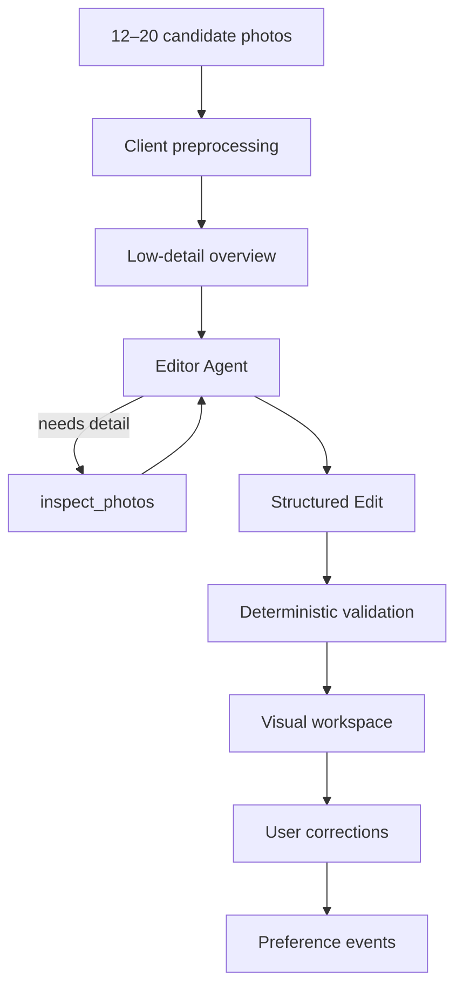

# EDIT.

A set-level AI visual editor for turning a group of good photographs into a coherent final sequence.

> Turn twenty good photos into the six that belong together.

Not a score. Not a cull. A visual edit.

## The problem

Technical culling solves obvious failures. The harder editorial problem begins when the remaining photographs are all good enough.

Photographers currently solve this with multimodal chat:

- “Which photo is best?”
- “3 or 7?”
- “Are these two redundant?”
- “What order should these go in?”

Chat is the wrong interface for a visual editing workflow. EDIT. is a persistent visual workspace that edits the **set**, explains decisions relative to the whole body of work, and records user corrections as preference events.

## Product principle

Evaluate `Photo × Set`, not `Photo` independently.

A photograph can be strong individually and still wrong for this set.

## Architecture



### Image flow

1. Originals stay in browser memory for the session
2. Client creates resized JPEG working copies (~1600px long edge)
3. Working copies upload to **private** Vercel Blob under `sessions/<sessionId>/<photoId>.jpg`
4. `/api/edit` loads blobs server-side and runs the Editor
5. Temporary blobs are deleted in a `finally` block after the run

### Why one Agent

Known operations remain deterministic: upload, validation, reorder, replace, preference storage.

Agency is only justified for deciding which photographs need additional visual inspection before a confident set-level edit.

Multiple specialist agents would add latency and fragment set context without clear Day-1 value.

### Coarse-to-fine inference

Production uses the `adaptive` strategy:

- entire set at low detail
- `inspect_photos` tool with unique-photo budget = 8
- 1–3 IDs per tool call

Eval also supports `low-only` and `full-high` so we can test whether selective inspection is actually worth it.

## Privacy

- Original files are processed locally
- Resized working copies are temporarily uploaded
- Temporary Blob copies are deleted after the run
- User images are sent to the model provider for analysis
- No permanent user account or database exists in the MVP

Do not claim originals never leave the device in a way that implies no provider analysis.

## Evaluation

See [`evals/README.md`](evals/README.md).

Compare:

- `low-only`
- `full-high`
- `adaptive`

Metrics include must-include recall, must-exclude violations, selection overlap, unique inspections, latency, and token usage when available. Sequence quality remains partly subjective.

## Setup

```bash
pnpm install
cp .env.example .env.local
# fill OPENAI_API_KEY and BLOB_READ_WRITE_TOKEN
pnpm dev
```

Open [http://localhost:3000](http://localhost:3000) and `/studio`.

## Environment variables

```env
OPENAI_API_KEY=
OPENAI_MODEL=gpt-5.6-terra
BLOB_READ_WRITE_TOKEN=
DEMO_ACCESS_CODE=
NEXT_PUBLIC_DEMO_LOCK=false
NEXT_PUBLIC_APP_NAME=EDIT.
```

- `OPENAI_MODEL=gpt-5.6-sol` is useful for higher-quality experiments
- When `NEXT_PUBLIC_DEMO_LOCK=true`, the studio requires `DEMO_ACCESS_CODE` (stored in `sessionStorage`, checked server-side)

## Scripts

```bash
pnpm dev
pnpm lint
pnpm typecheck
pnpm test
pnpm build
pnpm eval
```

## Deployment

Target: Vercel.

1. Create a Vercel project from this repo
2. Create a Vercel Blob store and attach `BLOB_READ_WRITE_TOKEN`
3. Set `OPENAI_API_KEY` and other env vars in the Vercel project
4. Deploy via GitHub integration or `vercel`

API routes that use the Agents SDK / Blob SDK run on the **Node** runtime.

## Known limitations

- Editorial quality is subjective
- No RAW support
- Intentionally limited to 12–20 final candidates, not huge-shoot culling
- No Instagram performance model
- Personalization is intentionally primitive (raw pairwise preference events)
- No persistent account
- Working images are temporarily uploaded and sent to the model provider

## Future work

- Native mobile frontend
- Richer preference memory
- Set history
- Optional performance feedback
- Larger candidate sets
- Improved evaluation dataset

## Most important next experiment

Run the eval harness on real shoots and compare:

```text
low-only
vs
full-high
vs
adaptive
```

Do not conclude that the agentic design won before the experiment is run.
