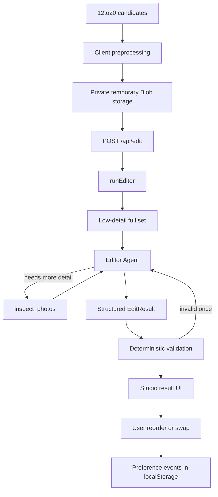

# EDIT.

**Turn twenty good photos into the six that belong together.**

EDIT. is a set-level AI visual editor. It does not score photos. It does not cull rejects. It helps you choose and sequence a coherent final set from photographs that are already good enough.

| | |
|---|---|
| **Product** | Visual editing workspace for 12–20 candidate photos |
| **Stack** | Next.js · TypeScript · OpenAI Agents SDK · Vercel Blob |
| **Status** | Day-1 MVP |
| **Repo** | https://github.com/ely808chen/edit |

---

## Table of contents

1. [Customer journey → problem → solution](#1-customer-journey--problem--solution)
2. [How the system works](#2-how-the-system-works)
3. [Guide: run it locally](#3-guide-run-it-locally)
4. [Guide: deploy to Vercel](#4-guide-deploy-to-vercel)
5. [Project structure](#5-project-structure)
6. [Commands & quality gates](#6-commands--quality-gates)
7. [Privacy & data flow](#7-privacy--data-flow)
8. [Evaluation](#8-evaluation)
9. [Limitations & roadmap](#9-limitations--roadmap)
10. [Contributing / Git workflow](#10-contributing--git-workflow)

---

## 1. Customer journey → problem → solution

### Journey

```text
Shoot ends
   ↓
Obvious bad frames are already gone
   ↓
12–20 photos remain — all plausible
   ↓
Hard decisions begin:
  • which belong together?
  • which are redundant?
  • what opens / closes the set?
  • what order tells the story?
   ↓
Today: paste into a chatbot, track IDs mentally, re-ask forever
   ↓
EDIT.: visual workspace → set-level edit → explained cuts → manual refine
```

### Who this is for

Serious hobby, travel, street, and thoughtful phone photographers who return with many *good* candidates and need a final selection for publishing or keeping — not a Lightroom-scale cull engine.

### The problem (what is *not* the problem)

| Not the hard part | The hard part |
|---|---|
| Deleting blurry / failed frames | Choosing among photos that are all good enough |
| Scoring every image 1–100 | Deciding what belongs *together* |
| Chat prompts like “which is best?” | Keeping the whole set in working memory while revising |

Chat is the wrong interface for this job. You end up tracking image numbers, current selections, relationships, and past preferences by hand.

### Product principle

> Evaluate **Photo × Set**, not Photo in isolation.

A frame can be strong alone and still wrong for *this* edit — redundant role, weak pacing, broken rhythm, or a quieter alternative that makes the sequence better.

### Solution

EDIT. is an **editor**, not a scorer:

1. Upload 12–20 candidates  
2. Choose objective: **Photography Set** or **Instagram Carousel**  
3. Choose final size: **4–8** (default 6)  
4. The Editor sees the full set, selectively inspects close calls, and returns an ordered sequence with roles and reasons  
5. You reorder or replace visually; replacements become preference signals for later edits  

One-sentence promise:

> **Turn twenty good photos into the six that belong together.**

Secondary line:

> Not a score. Not a cull. A visual edit.

---

## 2. How the system works

### High-level pipeline



### What happens on “Build my edit”

| Step | Where | What |
|---|---|---|
| 1. Select photos | Browser | Originals stay in session memory only |
| 2. Preprocess | Browser | Resize (~1600px long edge), JPEG ~0.82, strip metadata intent, build thumbnails |
| 3. Upload | Browser → Vercel Blob | Private paths `sessions/<sessionId>/p01.jpg` … — not originals |
| 4. Edit request | `POST /api/edit` | Sends blob references + mode + target count (+ optional preference examples) |
| 5. Load images | Server | Fetches private blobs into model-compatible data URLs |
| 6. Overview pass | Editor Agent | Entire set at **low** vision detail |
| 7. Selective inspection | `inspect_photos` tool | Up to **8 unique** photos at **high** detail (1–3 IDs per call) |
| 8. Structured output | Zod schema | Sequence, roles, reasons, notable cuts — **no numeric scores** |
| 9. Validation | Server | Exact count, unique IDs, positions, no hallucinations; **one** structural retry |
| 10. Cleanup | Server `finally` | Deletes temporary session blobs |
| 11. Refine | Studio UI | Drag reorder / replace; instant; no automatic re-run of the model |

### Why there is only one agent

Most of the app is deterministic code (upload, validation, UI, preference storage).

Agency is reserved for one decision:

> Which photographs need higher-detail inspection before a confident set-level edit?

A swarm of critic / composition / Instagram agents would add latency and split set context without clear Day-1 value.

### Adaptive inspection (the core hypothesis)

Production strategy: **`adaptive`**

- Start cheap: full set at low detail  
- Spend scarce attention: high-detail only where it could change the edit  
- Budget: **8 unique photo IDs**  

Eval also supports:

| Strategy | Behavior | Purpose |
|---|---|---|
| `low-only` | All low detail, no tool | Cheap baseline |
| `full-high` | All high detail, no tool | Quality ceiling / cost reference |
| `adaptive` | Low + selective inspect | Can we recover most of full-high quality cheaper? |

Do not treat “agentic” as automatically better — measure it (see [Evaluation](#8-evaluation)).

### Modes

| Mode | Objective |
|---|---|
| **Photography Set** | Strongest coherent body of work — quality, relationships, rhythm, atmosphere |
| **Instagram Carousel** | Sequence with strong first-frame readability, variety, pacing, strong ending |

### Output contract

The model must return **exactly** the user’s `targetCount` unique photo IDs (`p01`…`p20`), each with:

- editorial **role** (lead, establishing, human-scale, detail, …)  
- set-level **reason**  
- **relationshipToPrevious** (null for position 1)  
- optional **notable cuts** explained relative to selected frames  

---

## 3. Guide: run it locally

### Prerequisites

- Node.js 20+ (LTS fine)  
- [pnpm](https://pnpm.io)  
- OpenAI API key (vision-capable model access)  
- Vercel Blob read/write token  

### Step-by-step

1. **Clone**

```bash
git clone https://github.com/ely808chen/edit.git
cd edit
```

2. **Install**

```bash
pnpm install
```

3. **Create env file** at the repo root: `.env.local`

```bash
cp .env.example .env.local
```

4. **Fill secrets** in `.env.local` (never commit this file):

```env
OPENAI_API_KEY=sk-...
OPENAI_MODEL=gpt-5.6-terra
BLOB_READ_WRITE_TOKEN=vercel_blob_rw_...
DEMO_ACCESS_CODE=
NEXT_PUBLIC_DEMO_LOCK=false
NEXT_PUBLIC_APP_NAME=EDIT.
```

| Variable | Required | Notes |
|---|---|---|
| `OPENAI_API_KEY` | Yes | Server-only |
| `OPENAI_MODEL` | No | Default `gpt-5.6-terra`; try `gpt-5.6-sol` for experiments |
| `BLOB_READ_WRITE_TOKEN` | Yes | From Vercel → Storage → Blob |
| `NEXT_PUBLIC_DEMO_LOCK` | No | `true` enables shared access-code gate |
| `DEMO_ACCESS_CODE` | If lock on | Compared only on the server |
| `NEXT_PUBLIC_APP_NAME` | No | Brand string |

5. **Start**

```bash
pnpm dev
```

6. **Open**

- Marketing: http://localhost:3000  
- Studio: http://localhost:3000/studio  

7. **Run a real edit**

- Drop **12–20** JPEG / PNG / WebP images  
- Pick mode + final count  
- Click **Build my edit →**  
- Reorder / replace on the result screen  

### Common failures

| Symptom | Fix |
|---|---|
| Missing API key / 500 on edit | Check `.env.local`, restart `pnpm dev` |
| Upload fails | Check `BLOB_READ_WRITE_TOKEN` and Blob store |
| CTA disabled | Need 12–20 photos, all finished preprocessing |
| Demo lock message | Set code or set `NEXT_PUBLIC_DEMO_LOCK=false` |

---

## 4. Guide: deploy to Vercel

1. Import https://github.com/ely808chen/edit into [Vercel](https://vercel.com/new)  
2. Create a **Blob** store in the same Vercel team/project  
3. Add the same environment variables as `.env.local` to the Vercel project (Production ± Preview)  
4. Deploy  
5. Open `https://<your-deployment>/studio`  

API routes that use the Agents SDK / Blob run on the **Node** runtime (not Edge).

Optional public demo protection:

```env
NEXT_PUBLIC_DEMO_LOCK=true
DEMO_ACCESS_CODE=your-shared-code
```

---

## 5. Project structure

Think in four layers: **routes (UI + HTTP)**, **studio UI**, **domain libraries**, **verification**.

```text
edit/
├── README.md                 ← you are here (GitHub landing doc)
├── package.json              ← scripts & dependencies
├── .env.example              ← safe template (no secrets)
├── next.config.ts
├── vitest.config.mts
│
├── src/
│   ├── app/                  ← Next.js App Router
│   │   ├── page.tsx          ← landing (/)
│   │   ├── studio/page.tsx   ← product (/studio)
│   │   └── api/
│   │       ├── upload/       ← Vercel Blob client-upload token route
│   │       └── edit/         ← validate → load blobs → runEditor → cleanup
│   │
│   ├── components/
│   │   ├── landing/          ← marketing sections
│   │   ├── studio/           ← contact sheet, sequence, replace, trace, …
│   │   └── ui/               ← Button, Modal, SegmentedControl
│   │
│   ├── lib/
│   │   ├── ai/               ← Editor Agent, prompt, schemas, validation, tool
│   │   ├── images/           ← client preprocess + server image helpers
│   │   ├── storage/          ← private Blob fetch / session delete
│   │   ├── preferences/      ← localStorage preference events
│   │   ├── access/           ← optional demo access code
│   │   ├── studio/           ← studio reducer / state machine
│   │   ├── brand.ts          ← product name + consumer copy
│   │   └── utils/
│   │
│   └── types/                ← shared domain types (ClientPhoto, StudioState, …)
│
├── tests/                    ← Vitest unit tests (validation, budget, prefs)
├── evals/                    ← strategy comparison harness + docs
└── scripts/run-evals.ts      ← CLI entry for evals
```

### Mental model by folder

| Folder | Responsibility |
|---|---|
| `src/app` | Pages and HTTP boundaries only |
| `src/components/studio` | Visual editing workspace |
| `src/lib/ai` | Model orchestration (`runEditor` is reusable outside routes) |
| `src/lib/images` | Resize / encode on client; helpers on server |
| `src/lib/storage` | Temporary private Blob I/O |
| `tests` | Structural correctness without calling OpenAI |
| `evals` | Honest A/B/C of inspection strategies on real shoots |

### Important files (bookmark these)

| File | Why it matters |
|---|---|
| [`src/lib/ai/editor.ts`](src/lib/ai/editor.ts) | Core `runEditor()` — strategies, retry, debug metadata |
| [`src/lib/ai/inspect-photos-tool.ts`](src/lib/ai/inspect-photos-tool.ts) | Budget enforcement + high-detail tool output |
| [`src/lib/ai/validate-edit.ts`](src/lib/ai/validate-edit.ts) | Deterministic structural checks |
| [`src/lib/ai/schemas.ts`](src/lib/ai/schemas.ts) | Zod contracts for model + API |
| [`src/app/api/edit/route.ts`](src/app/api/edit/route.ts) | Thin HTTP wrapper around `runEditor` |
| [`src/components/studio/StudioShell.tsx`](src/components/studio/StudioShell.tsx) | End-to-end studio orchestration |
| [`src/lib/studio/reducer.ts`](src/lib/studio/reducer.ts) | Studio phase state machine |

---

## 6. Commands & quality gates

```bash
pnpm dev          # local app
pnpm lint         # ESLint
pnpm typecheck    # tsc --noEmit
pnpm test         # Vitest
pnpm build        # production build
pnpm eval         # strategy eval harness (needs API key + shoot images)
```

Before considering a change done:

```bash
pnpm lint && pnpm typecheck && pnpm test && pnpm build
```

---

## 7. Privacy & data flow

**Accurate claims**

- Original files stay on the device for the browser session  
- Smaller working copies are uploaded temporarily for analysis  
- Temporary Blob objects are deleted after `/api/edit` finishes (success or failure)  
- Image data is sent to the **model provider** during analysis  
- MVP has no accounts database and no permanent photo library  

**Do not claim**

- “Photos never leave your phone” (working copies + provider analysis would make that false)  
- Guarantees about the provider’s long-term retention beyond their own policies  

Logging policy: do not log base64 payloads or raw image bytes.

---

## 8. Evaluation

See [`evals/README.md`](evals/README.md).

The engineering question:

> Can adaptive inspection recover most of full high-detail editorial quality while using fewer high-detail inspections?

Setup outline:

1. Copy `evals/manifest.example.json` → `evals/manifest.json`  
2. Add 12–20 images per shoot folder  
3. Write ground truth **before** looking at model outputs  
4. Run `pnpm eval -- --manifest evals/manifest.json`  

Metrics are proxies. Sequence quality still needs human judgment. Do not declare the agent architecture “won” before running the experiment.

---

## 9. Limitations & roadmap

### Known limitations (Day 1)

- Editorial taste is subjective  
- No RAW / Lightroom library integration  
- Intentionally capped at 12–20 final candidates (not 5,000-image culling)  
- No Instagram engagement prediction  
- Preference memory is raw pairwise events (max 5 locally), not a trained user model  
- No login / permanent storage  

### Sensible next steps

- Native mobile frontend  
- Richer preference memory / set history  
- Larger candidate sets  
- Stronger evaluation dataset  
- Optional performance feedback loops  

Stretch ideas (only after core acceptance): shareable result image, blind A/B eval UI, localization.

---

## 10. Contributing / Git workflow

Default branch: **`main`**.

```bash
git checkout main
git pull origin main
git checkout -b cursor/short-description

# make focused changes
git add <related files>
git commit -m "Explain why this change exists"
git push -u origin HEAD
gh pr create --base main
```

Guidelines:

- Keep `main` deployable  
- One PR ≈ one concern  
- Never commit `.env.local` or API tokens  
- Prefer evidence (tests / evals) over architectural fashion  

---

## License / status

Personal / experimental MVP. Built as an experiment in **set-level multimodal reasoning** — optimizing for good engineering judgment, not maximum AI buzzwords.
